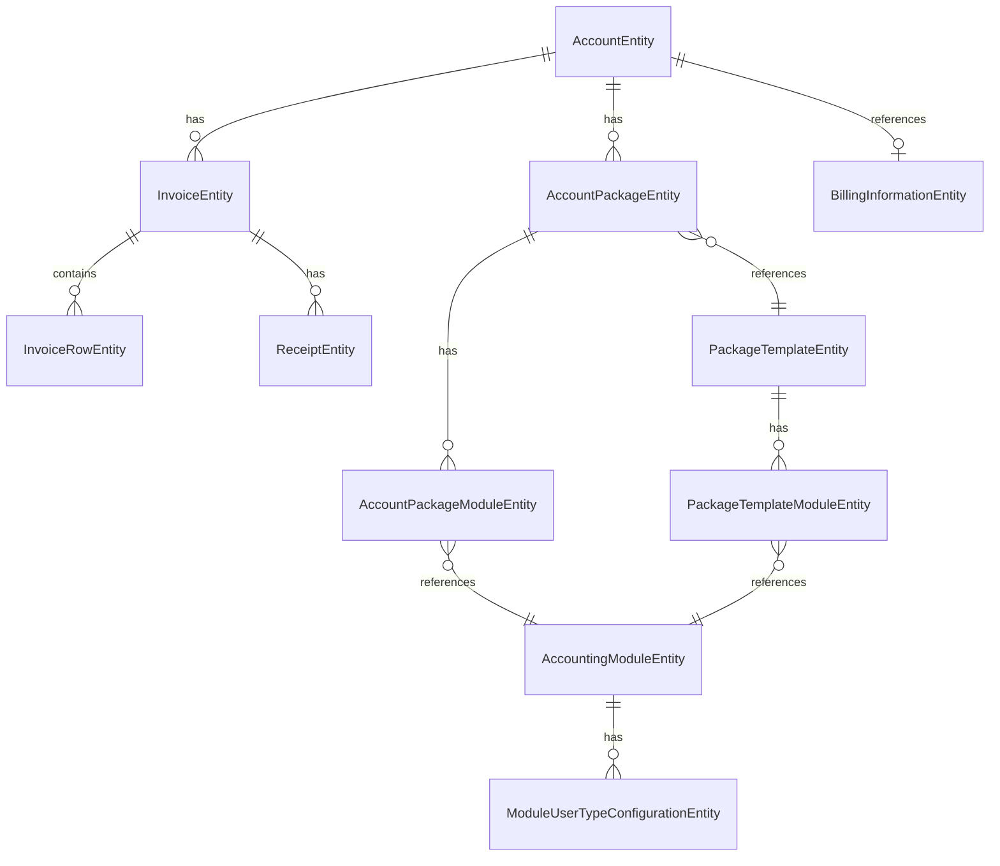
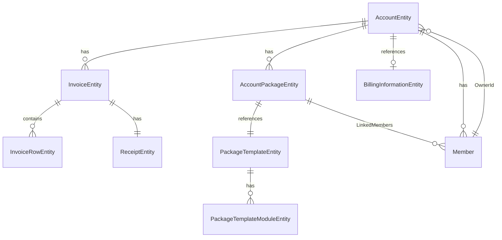

# Accounting Module Migration Visualization

## Overview

This document provides a comprehensive visualization of the entity refactoring performed on the Accounting Module's Domain.Shared layer.

## Entity Relationship Diagrams

### Before (Current State)



### After (Target State)



## Deleted Entities

### 1. AccountingModuleEntity
**File:** `Entities/AccountingModuleEntity.cs`

**Properties:**
- `Id: Guid`
- `TenantId: Guid?`
- `Name: string`
- `DocEntry: string`
- `ModuleUserTypeConfigurations: List<ModuleUserTypeConfigurationEntity>` (Navigation)
- `[NotMapped] CreatorName: string`

**Referenced By:**
- `ModuleUserTypeConfigurationEntity.AccountingModuleEntityId` (FK)
- `AccountPackageModuleEntity.ModuleEntityId` (FK)
- `PackageTemplateModuleEntity.ModuleEntityId` (FK)

### 2. ModuleUserTypeConfigurationEntity
**File:** `Entities/ModuleUserTypeConfigurationEntity.cs`

**Properties:**
- `Id: Guid`
- `TenantId: Guid?`
- `AccountingModuleEntityId: Guid` (FK to AccountingModuleEntity)
- `UserType: AccountType`
- `Price: decimal`
- `LimitationsJson: string`

**Referenced By:**
- `AccountingModuleEntity.ModuleUserTypeConfigurations` (Navigation)

### 3. AccountPackageModuleEntity
**File:** `Entities/AccountPackageModuleEntity.cs`

**Properties:**
- `Id: Guid`
- `TenantId: Guid?`
- `AccountPackageEntityId: Guid` (FK)
- `ModuleEntityId: Guid` (FK to AccountingModuleEntity)
- `IsEnabled: bool`
- `Price: decimal`
- `LimitationsJson: string`
- `[NotMapped] ModuleName: string`

**Referenced By:**
- `AccountPackageEntity.AccountPackageModules` (Navigation)

## Modified Entities

### PackageTemplateModuleEntity

**File:** `Entities/PackageTemplateModuleEntity.cs`

#### Changes

**Added:**
- `Guid? RefId`
- `ModuleType ModuleType` (enum: User | Role | OrgUnit | Feature | Service)
- `string Description`
- `string ModuleData`

**Modified:**
- `ModuleName` → `Name` (renamed, still [NotMapped])

**Deleted:**
- `Guid ModuleEntityId` (FK to deleted AccountingModuleEntity)
- `bool IsEnabledByDefault`

**Before:**
```csharp
public virtual Guid ModuleEntityId { get; set; }
public virtual bool IsEnabledByDefault { get; set; }
[NotMapped]
public string ModuleName { get; set; }
```

**After:**
```csharp
public virtual Guid? RefId { get; set; }
public virtual ModuleType ModuleType { get; set; }
public virtual string Description { get; set; }
public virtual string ModuleData { get; set; }
[NotMapped]
public string Name { get; set; }
```

### PackageTemplateEntity

**File:** `Entities/PackageTemplateEntity.cs`

#### Changes

**Added:**
- `PackageType PackageType` (enum: User | Tenant)
- `string Description`
- `int MaxMembers`
- `decimal Price`
- `AccountPackageEntity AccountPackage` (one-to-one navigation)

**Deleted:**
- `string DocEntry`
- `bool IsShowToReseller`
- `[NotMapped] string CreatorName`

**Before:**
```csharp
public virtual string DocEntry { get; set; }
public virtual bool IsShowToReseller { get; set; }
[NotMapped]
public string CreatorName { get; set; }
```

**After:**
```csharp
public virtual PackageType PackageType { get; set; }
public virtual string Description { get; set; }
public virtual int MaxMembers { get; set; }
public virtual decimal Price { get; set; }
public virtual AccountPackageEntity AccountPackage { get; set; }
```

### AccountPackageEntity

**File:** `Entities/AccountPackageEntity.cs`

#### Changes

**Added:**
- `List<Member> LinkedMembers`
- `PackageTemplateEntity PackageTemplate` (one-to-one navigation)

**Modified:**
- `double OneTimeDiscount` → `decimal OneTimeDiscount`
- `double PermanentDiscount` → `decimal PermanentDiscount`

**Deleted:**
- `string PackageName`
- `List<AccountPackageModuleEntity> AccountPackageModules` (navigation to deleted entity)

**Before:**
```csharp
public virtual string PackageName { get; set; }
public virtual double OneTimeDiscount { get; set; }
public virtual double PermanentDiscount { get; set; }
public virtual List<AccountPackageModuleEntity> AccountPackageModules { get; set; }
```

**After:**
```csharp
public virtual decimal OneTimeDiscount { get; set; }
public virtual decimal PermanentDiscount { get; set; }
public virtual PackageTemplateEntity PackageTemplate { get; set; }
public virtual List<Member> LinkedMembers { get; set; }
```

### AccountEntity

**File:** `Entities/AccountEntity.cs`

#### Changes

**Added:**
- `Guid OwnerId`
- `List<Member> Members`

**Deleted:**
- `string AccountNameEng`
- `AccountType Type`
- `DocumentStatuses DocumentStatus`
- `string AccountCurrency`
- `Guid? ResellerRefId`
- `Guid? AccountTenantId`
- `ResellerType ResellerType`
- `bool CreationFromTenant`
- All `[NotMapped]` properties:
  - `string CreatorName`
  - `DocumentVersionEntity DocumentVersionEntity`
  - `BillingInformationEntity BillingInformation`
  - `string ResellerRefName`

**Before:**
```csharp
public virtual string AccountNameEng { get; set; }
public virtual AccountType Type { get; set; }
public virtual DocumentStatuses DocumentStatus { get; set; }
public virtual string AccountCurrency { get; set; }
public virtual Guid? ResellerRefId { get; set; }
public virtual Guid? AccountTenantId { get; set; }
public virtual ResellerType ResellerType { get; set; }
public virtual bool CreationFromTenant { get; set; }

[NotMapped]
public string CreatorName { get; set; }
[NotMapped]
public DocumentVersionEntity DocumentVersionEntity { get; set; }
[NotMapped]
public BillingInformationEntity BillingInformation { get; set; }
[NotMapped]
public string ResellerRefName { get; set; }
```

**After:**
```csharp
public virtual Guid OwnerId { get; set; }
public virtual List<Member> Members { get; set; }
```

### InvoiceEntity / ReceiptEntity Relationship Change

**Files:**
- `Entities/InvoiceEntity.cs`
- `Entities/ReceiptEntity.cs`

#### Changes

**Relationship:** Changed from **one-to-many** to **one-to-one**

**Before:**
```csharp
// InvoiceEntity
public virtual List<ReceiptEntity> Receipts { get; set; }

// ReceiptEntity
public virtual Guid InvoiceEntityId { get; set; }
```

**After:**
```csharp
// InvoiceEntity
public virtual ReceiptEntity Receipt { get; set; }

// ReceiptEntity
public virtual Guid InvoiceEntityId { get; set; }
public virtual InvoiceEntity Invoice { get; set; }
```

### AccountPackageEntity / PackageTemplateEntity Relationship Change

**Files:**
- `Entities/AccountPackageEntity.cs`
- `Entities/PackageTemplateEntity.cs`

#### Changes

**Relationship:** Changed from **many-to-one** (FK only) to **one-to-one**

**Before:**
```csharp
// AccountPackageEntity
public virtual Guid PackageTemplateEntityId { get; set; }

// PackageTemplateEntity
// No navigation property
```

**After:**
```csharp
// AccountPackageEntity
public virtual Guid PackageTemplateEntityId { get; set; }
public virtual PackageTemplateEntity PackageTemplate { get; set; }

// PackageTemplateEntity
public virtual AccountPackageEntity AccountPackage { get; set; }
```

## New Components

### Member Class

**File:** `Entities/Member.cs`

```csharp
public class Member
{
    public Guid Id { get; set; }
    public Guid RefId { get; set; }
    public MemberType Type { get; set; }
}

public enum MemberType
{
    Tenant = 0,
    User = 1
}
```

**Used By:**
- `AccountEntity.Members: List<Member>`
- `AccountPackageEntity.LinkedMembers: List<Member>`

### ModuleType Enum

**File:** `Account/ModuleType.cs`

```csharp
public enum ModuleType
{
    User = 0,
    Role = 1,
    OrgUnit = 2,
    Feature = 3,
    Service = 4
}
```

**Used By:**
- `PackageTemplateModuleEntity.ModuleType`

### PackageType Enum

**File:** `Account/PackageType.cs`

```csharp
public enum PackageType
{
    User = 0,
    Tenant = 1
}
```

**Used By:**
- `PackageTemplateEntity.PackageType`

### Extended BillingPeriodType Enum

**File:** `Account/BillingPeriodType.cs`

**Before:**
```csharp
public enum BillingPeriodType
{
    Month = 0,
    Year = 1
}
```

**After:**
```csharp
public enum BillingPeriodType
{
    None = -1,
    Month = 0,
    Year = 1,
    Weekly = 2,
    Quarterly = 3
}
```

## Property Change Summary

| Entity | Property | Change Type | Details |
|--------|----------|-------------|---------|
| PackageTemplateModuleEntity | RefId | Added | `Guid?` |
| PackageTemplateModuleEntity | ModuleType | Added | `ModuleType` enum |
| PackageTemplateModuleEntity | Description | Added | `string` |
| PackageTemplateModuleEntity | ModuleData | Added | `string` |
| PackageTemplateModuleEntity | ModuleName | Renamed | → `Name` |
| PackageTemplateModuleEntity | ModuleEntityId | Deleted | FK to deleted entity |
| PackageTemplateModuleEntity | IsEnabledByDefault | Deleted | `bool` |
| PackageTemplateEntity | PackageType | Added | `PackageType` enum |
| PackageTemplateEntity | Description | Added | `string` |
| PackageTemplateEntity | MaxMembers | Added | `int` |
| PackageTemplateEntity | Price | Added | `decimal` |
| PackageTemplateEntity | AccountPackage | Added | One-to-one navigation |
| PackageTemplateEntity | DocEntry | Deleted | `string` |
| PackageTemplateEntity | IsShowToReseller | Deleted | `bool` |
| PackageTemplateEntity | CreatorName | Deleted | `[NotMapped] string` |
| AccountPackageEntity | LinkedMembers | Added | `List<Member>` |
| AccountPackageEntity | PackageTemplate | Added | One-to-one navigation |
| AccountPackageEntity | OneTimeDiscount | Type Changed | `double` → `decimal` |
| AccountPackageEntity | PermanentDiscount | Type Changed | `double` → `decimal` |
| AccountPackageEntity | PackageName | Deleted | `string` |
| AccountPackageEntity | AccountPackageModules | Deleted | Navigation to deleted entity |
| AccountEntity | Members | Added | `List<Member>` |
| AccountEntity | OwnerId | Added | `Guid` |
| AccountEntity | AccountNameEng | Deleted | `string` |
| AccountEntity | Type | Deleted | `AccountType` |
| AccountEntity | DocumentStatus | Deleted | `DocumentStatuses` |
| AccountEntity | AccountCurrency | Deleted | `string` |
| AccountEntity | ResellerRefId | Deleted | `Guid?` |
| AccountEntity | AccountTenantId | Deleted | `Guid?` |
| AccountEntity | ResellerType | Deleted | `ResellerType` |
| AccountEntity | CreationFromTenant | Deleted | `bool` |
| AccountEntity | All [NotMapped] | Deleted | 4 properties |
| InvoiceEntity | Receipts | Changed | `List<ReceiptEntity>` → `ReceiptEntity` |
| ReceiptEntity | Invoice | Added | One-to-one navigation |

## Migration Impact

### Database Changes Required

1. **Drop Foreign Key Constraints:**
   - `FK_EcAccountPackageModuleEntity_EcAccountingModules_ModuleEntityId`
   - `FK_EcModuleUserTypeConfigurationEntity_EcAccountingModules_AccountingModuleEntityId`
   - `FK_EcPackageTemplateModuleEntity_EcAccountingModules_ModuleEntityId`

2. **Drop Tables:**
   - `EcAccountingModules`
   - `EcModuleUserTypeConfigurationEntity`
   - `EcAccountPackageModuleEntity`

3. **Alter Tables:**
   - `EcPackageTemplateModuleEntity`: Add `RefId`, `ModuleType`, `Description`, `ModuleData`; Remove `ModuleEntityId`, `IsEnabledByDefault`
   - `EcPackageTemplateEntity`: Add `PackageType`, `Description`, `MaxMembers`, `Price`; Remove `DocEntry`, `IsShowToReseller`
   - `EcAccountPackageEntity`: Add `LinkedMembers` (JSON/table), change `OneTimeDiscount`/`PermanentDiscount` to decimal; Remove `PackageName`
   - `EcAccountEntity`: Add `OwnerId`, `Members` (JSON/table); Remove multiple columns
   - `EcInvoiceEntity`: Change `Receipts` relationship to one-to-one
   - `EcReceiptEntity`: Add unique constraint on `InvoiceEntityId`

4. **Add Unique Constraints:**
   - `EcAccountPackageEntity.PackageTemplateEntityId` (for one-to-one relationship)
   - `EcReceiptEntity.InvoiceEntityId` (for one-to-one relationship)

### Code Impact

- **Domain Services:** Comment code referencing deleted entities/properties
- **Application Services:** Comment DTOs and app services for deleted entities
- **Application Contracts:** Comment interfaces and DTOs
- **HttpApi:** Comment controllers for deleted entities
- **EF Core:** Update DbContext, remove DbSets, update ModelCreating
- **Repositories:** Comment/remove repository implementations for deleted entities

## Breaking Changes

1. **API Breaking:** All endpoints using deleted entities will be removed/commented
2. **DTO Compatibility:** Existing DTOs with deleted properties will break clients
3. **Database Schema:** Foreign key constraints must be dropped before entity deletion
4. **Data Migration:** Existing data in deleted entities must be migrated or cleaned up
